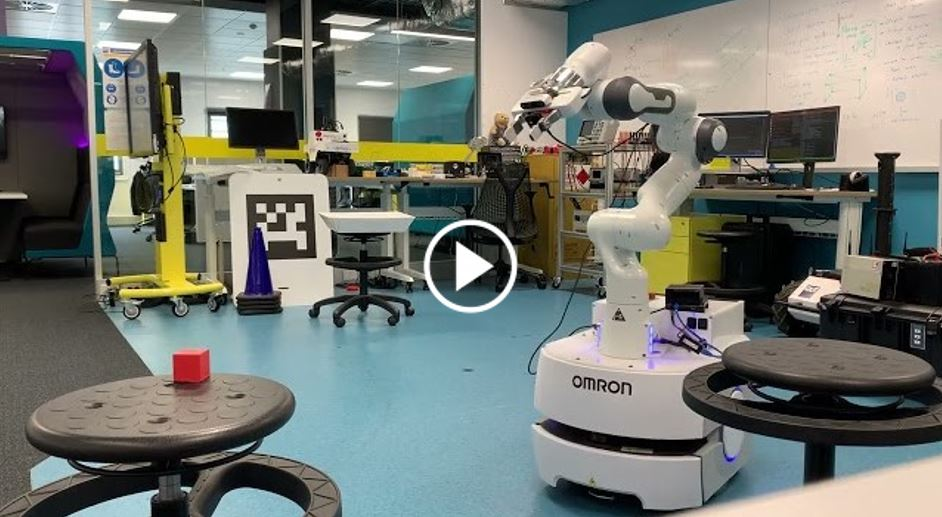
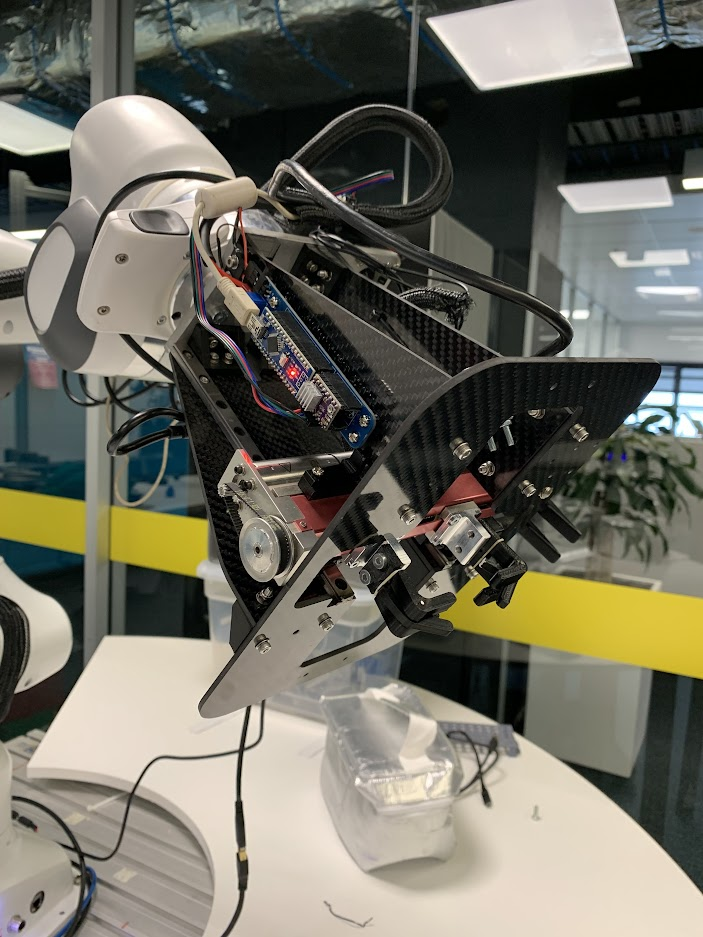

I'm Ben, a PhD candidate at the QUT Centre for Robotics. My thesis titled "Grasping on the Move: Mobile Manipulation in Dynamic, Unstructured Environments" explores how mobile robots can perform tasks more quickly and gracefully in complex environments. 

My goal is to develop robots that break down stereotypes about what it means for motion to be *robotic*. I am interested in all facets of robotics development, including mechanical, electrical, and software design. 

# Manipulation *On-The-Move*
I have been developing an architecture to enable reactive manipulation while a mobile robot remains in motion. This approach results in fast, graceful, and reliable performance.

More details are [available here](https://github.com/BenBurgessLimerick/ManipulationOnTheMove)

<!--  -->

# DGBench: An Open-Source, Reproducible Benchmark for Dynamic Grasping
<!-- Dynamic grasping performance is often largely anecodotal, with no clear definitions of what is meant by "dynamic grasping". Experiments range from objects moving with continous predictable motion such as on a conveyor belt, to objects that are moved randomly by hand, but the motion stops before the grasp is complete. -->

To encourage meaningful comparison of dynamic grasping performance I developed a testing system that provides reproducible object motion. I used the system to investigate the perception challenges specific to grasping in dynamic environments.

Find out more about DGBench [here](https://github.com/BenBurgessLimerick/DGBench)

# Intravehicular Robotics Cargo Transfer Bag Relocation System Gripper
I was responsible for the mechanical and electrical design of a prototype gripper to manipulate cargo transfer bags on space stations. These bags have buckles and deformable handles designed for human use, which presents interesting challenges for automated handling in the zero-gravity environment of space.  

See the gripper in action [here](https://www.youtube.com/watch?v=ymAvM0AEL58&ab_channel=JamesMount)

# TugBot

TugBot is a completely custom ROS-based mobile robot using hoverboard wheels and [ODrive motor controllers](https://odriverobotics.com/). The robot is controlled by a bespoke app built for iOS.

Learn more [here](https://github.com/BenBurgessLimerick/TugBot)

